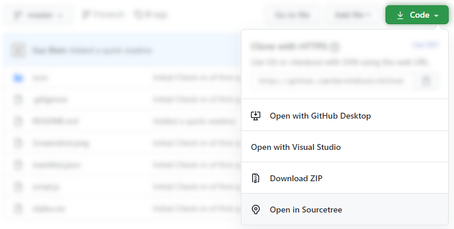

# GitHub Clone to SourceTree Button

## Description
This is a simple chrome plug-in that adds a button into the GitHub "Code" dropdown that opens SourceTree's clone window with all the details populated to clone the GitHub project you're currently on.

## Installing
It can be installed from the Chrome App Store [here](https://chrome.google.com/webstore/detail/github-clone-to-sourcetre/eopgibgcmlglaofajpkhoomnbdedijmb).